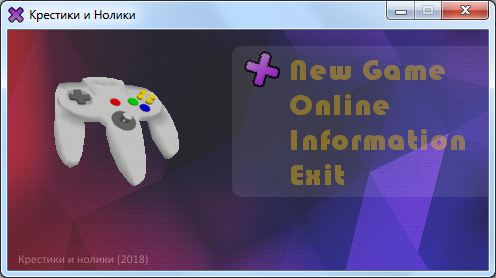
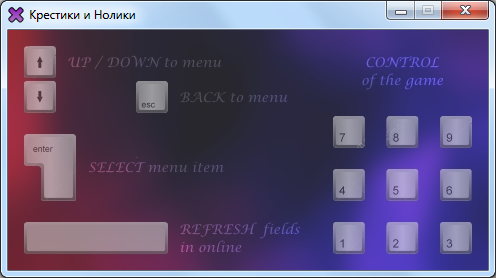
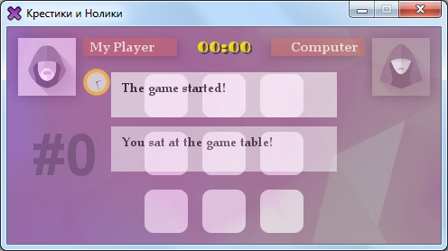
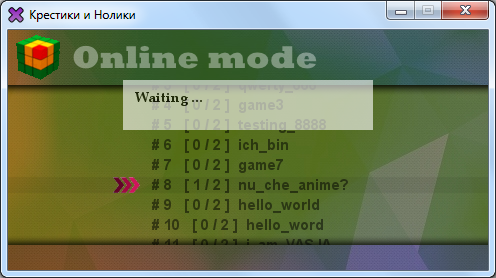
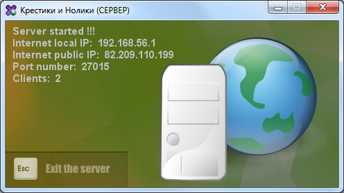
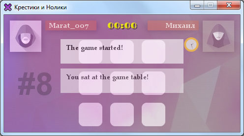
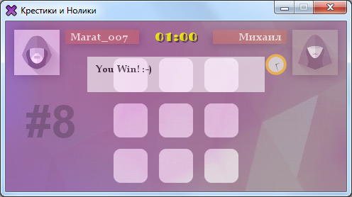

# TicTacToy
Client-server game for PC "Tic-Tac Toy"
------------

PolyServer - многопользовательский сервер для игры "Крестики и Нолики" (simpleGame),
написанный на обычных блокирующих сокетах. Прежде, чем запустить в игре режим Онлайн,
необходимо запустить Сервер. Настройки сервера находятся в файле setServer.txt.
Настройки клиента игры/ профиля игрока - находятся в проекте игры в файле setClient.txt
Джар файлы проекта находятся в папке out/artifacts/...

Settings
------------

> Файл setServer.txt несет в себе настройки запускаемого сервера,  назначаемый порт и
  список игровых столов (до 16 включительно) для игры в режиме Онлайн.  
  Файл setClient.txt несет в себе настройки твоего профиля, как онлайн-клиента игры,
  а также данные порта и ip адреса сервера, к которому необходимо подсоединиться для игры
  в режиме Онлайн.  
  Внимание: файлы не следует редактировать в IDE (InteliJ), так как каким
  то образом редактор IDE добавляет в начало файла (строки) неопознанный символ, после чего
  данные о настройках клиента могут прочитаться неправильно. Желательно открыть файл настроек
  стандартным блокнотом.  
  В настройках setServer.txt окончание строки, перечисление параметров обозначается слэшем '/'. Так,
  например, если хотите создать 3 игровых стола (game1, game2, game3), то после ключевого
  слова field и двоеточия следует прописать без пробелов 'game1/game2/game3/'. Последний слэш
  символизирует окончание списка.  
  Значения параметров прописывать без пробела!!!

Screenshots
------------

